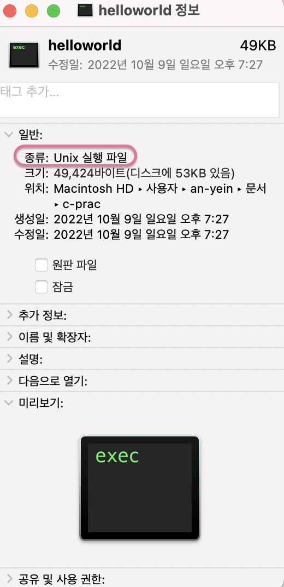

# Chapter01. 프로그램 만들기

- C언어는 1972년 탄생했으며, 데니스 리치가 UNIX 시스템에 사용하기 위해 만들었다.

  

- <b>컴파일(compile)</b>이란, 소스 파일을 기계어로 바꾸는 과정을 의미한다.

  - 소스 파일을 왜 기계어로 바꿔야 하는가? : 소스 파일은 C언어 등 프로그래밍 언어로 작성한 문서를 의미하는데, 컴퓨터는 기계어만 이해하기 때문에 소스 파일을 바로 이해하지 못한다.

  > <b>컴파일 언어 vs 인터프리터 언어</b>
  > - 컴파일 언어: 소스 파일 "전체"를 기계어로 번역한 뒤, 이렇게 번역된 코드를 한번에 실행하는 방식 (예: C언어)
  > - 인터프리터 언어: 소스 코드 "한 줄씩" 번역하고 실행하는 방식 (예: 자바스크립트)

- 컴파일은 컴파일러(compiler)라는 프로그램으로 수행한다. 이 교재에선 비주얼 스튜디오 커뮤니티 컴파일러를 사용하는데, 이 외에도 여러 컴파일러가 있다고 한다.

  - 교재에서 하라는대로 비주얼 스튜디오를 설치하려고 했으나, 맥에서는 Visual Studio for mac을 설치해야 하고 이는 윈도우에서의 Visual Studio와 달리 기능이 많이 빠져있다고 한다.

  - 그래서 아래 블로그 글 참고해서 VS Code에 몇 가지 환경설정 하니까 실습 잘 진행할 수 있었음.

    - [[MacOS] Visual Studio Code로 C/C++ 코딩하기](https://wooono.tistory.com/299)

  - 컴파일러는 따로 설치해야 하나 했는데 VS Code 문서 보니까 맥은 이미 컴파일러가 설치되어 있다고 한다. 혹시 진짜 설치되어 있는지 확인해보고 싶다면 아래 문서 내용 참고해서 컴파일러 설치 여부를 확인해 볼 수 있다.

    - [Check if you have a compiler installed (VS Code docs)](https://code.visualstudio.com/docs/languages/cpp#_check-if-you-have-a-compiler-installed)

      

- 소스 코드 작성하고 단축키(<kbd>cmd+shift+b</kbd>)를 눌러서 컴파일할 수 있다. 윈도우의 경우에는 컴파일 결과물이 .exe 형식으로 만들어지나본데, 윈도우용 실행 파일이라서 맥에서는 실행이 안된다. 그럼 맥에서 컴파일한 결과물은 어떤 모습일까?? 다음 그림과 같이 Unix 실행 파일이라고 뜬다.

  

- C 언어로 작성된 파일은 어떻게 생겼는지 궁금해서 유튜브에서 'C 언어 기초 강의' 같은 거 슬쩍 보면, 매번 파일 상단의 `#include <stdio.h>` 때문에 지레 겁먹고 C 언어에 대해서 그만 알아보곤 했다. 샵도 무섭게 생겼고 stdio는 스튜디오도 아니고 뭐야~ 하면서 뒤로가기 눌렀던.. 이 책에서는 이 문이 의미하는 바를 쉽게 설명해주고 있다.

  ```c
  #include <stdio.h>

  int main(void)
  {
    printf("Be happy!");

    return 0;
  }
  ```

  - `stdio`는 standard input output(표준입출력)을 의미하고, `stdio.h`에는 C 언어에서 사용하는 기본 입출력 함수가 들어있다. 위 코드에서 `printf`는 C 언어 표준 "출력" 함수고, `stdio.h` 파일 들어가서 보면 알 수 있듯이 이 함수도 `stdio.h`에 들어있다.

    

  - 그리고 `#include <파일>`은 특정 파일의 내용을 프로그램 안에 복사한다는 의미라고 한다.

- 함수 쓰는 컨벤션이 좀 특이한 것 같다. 자바스크립트는 아래와 같은 방식으로 쓰는데, C 언어는 함수의 머리와 몸통을 아예 분리해서 쓰는 게 컨벤션인지??
  ```c
  int main(void) {
    printf("Be happy!");

    return 0;
  }
  ```

- 그리고 C 언어는 문장 끝에 세미콜론을 필수적으로 붙여줘야 한다는데, 자바스크립트/리액트로 개발하시는 분들 중에 일부러 세미콜론 아예 안 붙이는 걸 선호하는 경우도 좀 봐서 그런 부분에서 대조돼서 신기했다.

- 컴파일 과정을 자세히 살펴보면 다음과 같이 3단계로 나눠진다고 한다.

  1. 전처리(preprocess) : 전처리 지시자(`#include`)에 따라 소스 파일을 가공하는 과정. 주석도 이때 모두 제거된다. 이러한 전처리 과정에선 파일 형태에는 변화가 없다.
  2. 컴파일 : 전처리된 파일을 컴파일하면 개체 파일(object file)이 된다. 개체 파일이란, CPU가 해석할 수 있는 명령어들로 이루어진 기계어 파일. 그러나 개체 파일은 바로 실행할 수 없다. 프로그램은 운영체제에 의해 실행되기 때문에, 우선은 이 파일을 운영체제가 인식할 수 있는 형태로 바꿔야 한다.
  3. 링크(link) : 개체 파일에 startup code를 결합하는 과정. startup code는 프로그램 실행에 필요한 준비 작업을 수행하고, `main` 함수를 호출하는 일을 한다.