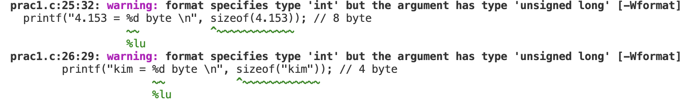

# Chapter02. 상수와 데이터 출력

## C 프로그램의 구조와 데이터 출력 방법

- C 프로그램은 함수(일정한 기능을 수행하는 코드 단위)로 만든다.

  - 간단한 프로그램은 `main` 함수 하나만으로 만들기도 함.

  - `main` 함수는 프로그램의 시작을 의미하며, 프로그램에서 반드시 있어야 함.

- 함수는 머리(head), 몸통(body)으로 이루어져 있음.

  - 이 중 머리는 <b>함수 원형(function prototype)</b>이라고도 함.

- [제어 문자(control character)](https://ko.wikipedia.org/wiki/%EC%A0%9C%EC%96%B4_%EB%AC%B8%EC%9E%90) : 문자는 아니지만 출력 방식에 영향을 주는 문자로서, 백슬래시(`\`)와 함께 사용함.

  - 제어 문자를 문자열 안에 포함시키면 해당 제어 문자의 기능에 따라 출력 형태를 바꿈.

  - 제어 문자 종류

    - `\n` : 개행(new line) - 다음 줄로 이동

    - `\t` : 커서가 다음 탭 위치로 이동 (열을 맞춰 출력할 때 사용하면 좋다고 함.)

    - `\b` : 백스페이스(backspace) - 커서가 한 칸 왼쪽으로 이동

    - `\r` : 캐리지 리턴(carriage return) - 커서가 첫 번째 칸으로 이동

      

      > In pre-computer days, typewriters were equipped with a lever on the left-hand side known as a carriage return. When pressed, the mechanism sent the paper-holding cylinder, or carriage, to the right, and at the same time, rotated the paper upward to begin a new line. (출처: [What is Carriage Return?](https://www.easytechjunkie.com/what-is-carriage-return.htm))

      - https://www.youtube.com/embed/4etk_viTUg4

    - `\a` : 알럿 경보(alert) - 벨소리를 내거나 프로그램 실행창을 깜빡이기도 한다고 하는데 일단 내 컴퓨터에선 아무 일도 안 일어남.

- `printf` 함수(print formatted라는 의미로, 일정한 형식에 따라 출력)는 기본적으로 문자열을 출력하는 함수여서, 숫자를 출력할 때는 <b>변환 문자</b>를 사용해서 문자열로 변환을 먼저 해줘야 됨.

  - 이때 사용되는 변환 문자는 데이터의 형태에 따라 다르며, 숫자의 경우 정수는 `%d`, 실수는 `%lf`를 사용함. (이때 d는 decimal의 줄임말이고 lf는 long float의 줄임말)

    ```c
    printf("%d\n", 14);
    printf("%lf\n", 3.5);
    ```

  - `%lf`로 실수 출력 시 기본적으로 소수점 이하 6자리까지 출력됨. 소수점 자릿수 바꾸려면 `%와 `lf` 사이에 소수점을 찍고 자릿수 지정하면 됨. 이때 잘리는 값은 반올림해서 출력됨.

    ```c
    printf("%lf\n", 3.5); // 3.500000
    printf("%.2lf\n", 3.5); // 3.50
    printf("%.2lf\n", 2.166); // 2.17
    ```

## 상수와 데이터 표현 방법

> 이 절에서는 C 언어에서 다루는 데이터인 정수, 실수, 문자, 문자열의 상수 표현법과, 컴파일된 후 어떤 형태로 바뀌는지 살펴본다.

### 정수 상수 표현법

- 정수는 10진수, 8진수, 16진수로 표시할 수 있다.

  - 2진수로는 표시하지 않는다. 왜냐하면 2진수는 표현 형태가 길어지므로 사용하기에 비효율적이기 때문이다.

- C 언어에서는 진법을 어떻게 구분할 수 있을까?

  - 진법 : 수를 표현하는 방법

  - 수학에서는 다음과 같이 밑수를 사용해서 진법을 표기할 수 있지만, 프로그래밍 언어에서는 이렇게 밑수를 표기할 수 없다.

    

    - 10진수의 9를 예로 들면, 8진수에서는 11, 16진수에서도 9로 표현하기 때문에 9, 11, 9만 보면 이게 10진수인지 8진수인지 구분이 안 된다.

  - 그래서 C 언어에서는 8진수는 숫자 앞에 `0`을, 16진수는 숫자 앞에 `0x`를 붙여 구분한다.

    |10진수|8진수|16진수|
    |------|---|---|
    |`9`|`011`|`0x9`|

- 정수 9를 세 가지 진법으로 <b>표현</b>하여 <b>출력</b>하면 다음과 같다.

  ```c
  // 10진수
  printf("%d\n", 9); // 9

  // 8진수
  printf("%d\n", 011); // 9

  // 16진수
  printf("%d\n", 0x9); // 9
  ```

  - 코드 상에서 진법에 따른 <b>표현법</b>은 다르더라도 <b>값</b>은 같으므로 출력 결과가 모두 동일하다.

- 이렇게 10진수 말고 8진수 또는 16진수로 출력하려면 다음과 같이 변환 문자를 사용하면 된다.

  ```c
  printf("%d\n", 12); // 12

  // %o 👉 8진수로 출력
  printf("%o\n", 12); // 14

  // %x 👉 16진수로 출력 (소문자)
  printf("%x\n", 12); // c

  // %X 👉 16진수로 출력 (대문자)
  printf("%X\n", 12); // C
  ```

### 실수 상수 표현법

- 실수는 소수점 형태와 지수 형태로 표현할 수 있는데, 이공계열에서는 지수 형태(지수 표기법)으로 표기한다.

  

- 지수 형태를 C 언어 표기법으로 바꾸려면, 우선 `✖️10`을 `e`(또는 `E`)로 바꾸고 지수는 그 옆에 숫자로 표기한다. 에를 들어 위 그림의 값을 C 언어 표기법으로 바꾸면 `12345e-4`가 된다.

- 지수 형태는 지수 값의 크기에 따라 다르게 표현할 수 있다. 예를 들어 0.0000314는 다음과 같이 표현할 수 있다.

  

- 이와 같이 하나의 값을 표현하는 여러 지수 형태 중, <b>소수점 앞에 0이 아닌 유효 숫자 한 자리를 사용하여 지수 형태로 바꾼 것</b>을 <b>정규화(normalization) 표기법</b>이라고 한다. 위 이미지를 예로 들면 첫 번째가 정규화에 해당한다.

  - `printf` 함수가 실수를 지수 형태로 출력할 때는 기본적으로 <b>정규화 표기법</b>을 사용한다. 지수 형태로 출력하려면 다음과 같이 `%le` 변환 문자를 사용하며, 별도로 소수점 자릿수 지정을 하지 않으면 <b>소수점 이하 6자리</b>까지만 출력된다.

    ```c
    printf("%le\n", 0.0000314); // 3.140000e-05
    printf("%.2le\n", 0.0000314); // 3.14e-05
    ```

### 문자와 문자열 상수 표현법

- 문자 vs 문자열

  - 문자

    - 작은따옴표로 묶는다. (예: `'A'`)

    - `printf` 함수로 출력할 때 `%c` 변환 문자를 사용한다.

  - 문자열

    - 큰따옴표로 묶는다. (예: `"A"`)

    - `printf` 함수로 출력할 때 변환 문자를 사용하지 않고 바로 출력할 수 있으나 보통은 `%s` 변환 문자를 사용한다.

### 상수가 컴파일된 후의 비트 형태

- 편집기에 코드를 입력하면, 이 코드는 컴퓨터가 이해할 수 있는 형태인 <b>아스키 코드</b> 값으로 저장된다. 즉 각각 하나의 문자로 저장되기 때문에, 컴파일이 없더라면 컴퓨터 입장에선 연산이 가능한 값이 아니라 그저 문자일 뿐이다.

  - 아스키 코드는 사람이 사용하는 기호를 컴퓨터 안에서 표현하는 방법에 대해 약속한 것으로, 초기에는 총 128개의 문자를 코드화했었다. 128개의 문자에는 영문 대문자, 영문 소문자, 아라비아 숫자, 특수 문자, 제어 문자 등이 포함된다. ([🗓아스키 코드표](https://www.ascii-codes.com/))

- 컴퓨터는 모든 데이터를 비트(bit)로 변환하고, 비트가 8개면 이를 1바이트(byte)라고 한다. 1비트는 0 또는 1 이렇게 2개의 값을 가질 수 있으니 1바이트(=2<sup>8</sup>)의 값은 256가지가 된다.

- 상수 종류별로 컴파일을 통해 변경되는 형태가 다르다.

  |상수 종류|byte|변경 형태|
  |------|---|---|
  |`정수`|컴파일하면 4바이트로 표현|`2진수`|
  |`실수`|컴파일하면 8바이트로 표현|`IEEE 754 표준 double형`|
  |`문자`|컴파일하면 4바이트로 표현|`2진수 형태의 아스크 코드 값`|

  - 어떤 상수를 쓰는지에 따라 실행 속도 및 정확도에 차이가 날 수 있기 때문에, 프로그래밍할 때 가능하면 정수 상수를 사용하는 것이 좋다고 함. 정수가 가장 빠르고 정확하게 연산될 수 있는 형태라고 함.

  - 상수의 크기는 값의 범위나 컴파일러에 따라 다를 수 있다고 함. 상수 크기를 확인할 필요가 있다면 `sizeof` 연산자를 사용하면 됨.

    - `sizeof` 연산자는 `size_t` 타입을 반환하는데, `size_t` 타입은 '이론상 가장 큰 사이즈를 담을 수 있는 unsigned 데이터 타입'이라고 한다.

      > size_t에 대해 잘못 알고 있는 분들 정말 많군요. 원문 어디에도 unsigned int 라는 말은 없습니다. size_t는 '이론상 가장 큰 사이즈를 담을 수 있는 unsigned 데이터 타입'으로 정의됩니다. 즉, 32비트 머신에서는 32비트 사이즈의 unsigned 정수형(int가 아니라 그냥 '정수'를 의미합니다), 64비트 머신에서는 64비트 사이즈의 unsigned 정수형(unsigned long long)입니다. 향후 등장할지도 모르는 128비트 머신이라던가 더 큰 머신이 존재한다면 그에 따라 더 큰 사이즈가 되겠지요.
      > 
      > 이 내용은, 동영상 파일같이 4기가를 넘어가는 파일들을 처리하거나 큰 데이터를 처리하려 할 때 이 사실을 반드시 알고 있는게 좋습니다. 어설프게 unsigned int인줄 알고 int나 unsigned int로 형변환을 해서 사용하다가 범위를 벗어나는 버그를 발생시킬 가능성도 있으니까요.
      > 
      > (출처: [size_t는 정확히 어떤 타입인가요?](https://hashcode.co.kr/questions/754/size_t%EB%8A%94-%EC%A0%95%ED%99%95%ED%9E%88-%EC%96%B4%EB%96%A4-%ED%83%80%EC%9E%85%EC%9D%B8%EA%B0%80%EC%9A%94))

    - 그래서 `printf` 함수로 값을 출력하려고 할 때 `%d` 변환 문자를 사용하면 다음과 같이 경고가 뜬다. `%zu` 또는 `%lu` 변환 문자를 사용하면 된다. ([참고](https://stackoverflow.com/questions/36121399/format-specifies-type-int-but-the-argument-has-type-unsigned-long-error-when))

      

    - `sizeof` 연산자 사용 예시

      ```c
      printf("4.153 = %lu byte \n", sizeof(4.153)); // 8 byte
      printf("kim = %lu byte \n", sizeof("kim")); // 4 byte
      printf("9 = %lu byte \n", sizeof(9)); // 4 byte
      printf("1 = %lu byte \n", sizeof(1)); // 4 byte
      printf("0 = %lu byte \n", sizeof(0)); // 4 byte
      ```

- 문자 상수를 컴파일하면 2진수 형태의 아스키 코드 값으로 변환된다.

  > 예) 문자 `'A'` 👉 아스키 코드 값 65 👉 정수 상수 65와 같은 형태로 번역됨.

  - 결국 문자 상수는 <b>소스 코드</b>에서 문자임을 "표현"하는 방법이며, <b>컴퓨터 안</b>에서는 정수와 같은 방식으로 "처리"되는 것이다.

- 정수 상수의 변환

  - 양수의 변환

    - MSB와 LSB

      - 가장 왼쪽에 있는 비트 👉 가장 큰 자릿수 비트 👉 [Most Significant Bit(MSB, 최상위 비트)](https://ko.wikipedia.org/wiki/%EC%B5%9C%EC%83%81%EC%9C%84_%EB%B9%84%ED%8A%B8)

      - 가장 오른쪽에 있는 비트 👉 가장 작은 자릿수 비트 👉 [Least Significant Bit(LSB, 최하위 비트)](https://ko.wikipedia.org/wiki/%EC%B5%9C%ED%95%98%EC%9C%84_%EB%B9%84%ED%8A%B8)

    - 4바이트로 표현할 수 있는 정수의 최댓값은 2<sup>32</sup>-1로 4294967295이고, 이 값보다 큰 상수를 사용하게 될 경우 컴파일러가 자동으로 데이터 크기를 8바이트로 늘려 처리한다고 한다...고 하는데, 교재에 나와 있는 이 내용과 달리 내가 코드를 실행한 환경에서는 출력 결과를 보면 4294967295도 8바이트로 처리되는 듯 하다. 2<sup>31</sup>-1(=2147483647)까지만 `int` 타입 ㅇㅈ해서 4바이트로 처리되고 2<sup>31</sup>(=2147483648)부터는 `int` 타입이 아닌 `long` 타입으로서 8바이트로 처리된다.

      ```c
      const int test = pow(2.0, 31.0) - 1;

      printf("4294967295 = %lu byte \n", sizeof(4294967295)); // 8 byte
      printf("4294967296 = %lu byte \n", sizeof(4294967296)); // 8 byte
      printf("%d = %lu byte \n", test, sizeof(test)); // 4 byte
      ```

    - 값의 크기 상관없이 데이터 크기를 8바이트로 만들고 싶을 땐 정수에 접미사 `LL`(또는 `ll`)을 붙이면 된다고 함.

  - 음수의 변환

    - C 언어에선 음수를 변환할 때, 음수의 절댓값을 <b>2의 보수</b>로 바꾸어 처리한다.

      - <b>2의 보수</b>는 <b>1의 보수</b>에 1을 더한 값이다.

      - <b>1의 보수</b>는 2진수의 0과 1을 바꾼 상태를 말한다.

    - 이와 같이 음수를 2의 보수로 처리하는 이유는, 특별한 변환 과정 없이 바로 양수와 음수를 더할 수 있기 때문이라고 한다.

- 실수 상수의 변환

  - 실수를 표현할 땐 IEEE 754 표준을 따르고, 이 표준에는 `single`, `double`, `quad` 이렇게 세 가지 형식이 있는데 그 중에서 `double` 형식을 가장 많이 사용한다고 한다.

  - `double` 형식은 실수를 64비트로 나타내는데, 64비트는 다음과 같이 구성되어 있다.

    - 부호 비트 : 가장 왼쪽 비트로서, 양수는 0 음수는 1로 표시함.

    - 지수부 : 부호 비트 다음부터 등장하는 11비트는 지수값을 나타낸다.

    - 소수부 : 나머지 52비트는 소수값을 의미한다.
