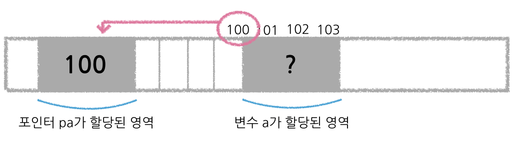
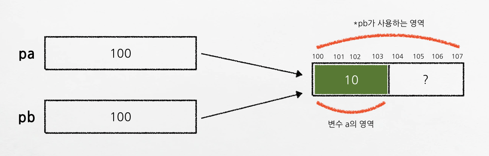

# Chapter09. 포인터

> 포인터는 어렵지 않다(고 한다).. 헷갈릴 뿐..

## 포인터의 기본 개념

### 메모리의 주소

- 어떤 프로그램이 사용하는 메모리의 위치는 주소 값으로 식별할 수 있다.

  - 주소 값은 바이트 단위로 구분된다.

  - 주소 값은 0부터 시작하고, 바이트 단위로 1씩 증가한다.

### 주소 연산자 : `&`

- 주소: 변수가 할당된 메모리 공간의 시작 주소

- 주소는 주소 연산자(`&`)를 사용해서 구한다.

  ```c
  int a;
  printf ("a의 주소: %p\n", &a); // a의 주소: 0x16b193148
  ```

  - 단항 연산자

  - 피연산자로는 변수만 사용할 수 있음.

  - 주소는 보통 16진수로 표기함.

  - 주소 전용 변환 문자: `%p`

### 포인터와 간접 참조 연산자 : `*`

- 메모리 주소는 매번 주소 연산을 수행해서 사용하는 것 보다는, 한 번 구한 주소를 변수에 저장해서 사용하면 편리

  - 이때 사용하는 변수(즉, 주소 값을 저장하기 위해 사용하는 변수)가 바로 <b>포인터</b>

- 포인터도 일반적인 변수처럼 선언하고 사용하면 되는데, 선언할 때 변수 앞에 `*`를 붙여줘야 함.

```c
int a;      // 일반 변수 선언
int *pa;    // 포인터 선언

pa = &a;    // 포인터에 a의 주소 대입
*pa = 10;   // 포인터로 변수 a에 10을 대입

printf ("변수명으로 a 값 출력하기: %d\n", a);   // 10
printf ("포인터로 a 값 출력하기: %d\n", *pa);   // 10
```



- 포인터 선언 방법

  ```c
  자료형 *변수명;
  ```
  (`*`는 포인터임을 표시하는 기호)

- 이와 같이 포인터가 어떤 변수의 주소를 저장한 경우 '가리킨다'라고 한다.

- 포인터가 어떤 변수를 가리키면, 그 포인터로 그 포인터가 가리키는 변수를 사용할 수 있다.

  - 즉 포인터 `pa`로 `a`를 사용할 수 있다.

  - 이렇게 사용하려면 간접 참조 연산자(`*`)를 사용하면 된다.

### 여러 가지 포인터 사용해보기

- 포인터가 어떤 변수를 가리키게 되면, 그 이후에는 간접 참조 연산자(`*`)를 통해 해당 변수를 사용할 수 있다.

- 일반 변수를 그 변수명으로도 사용할 수 있고, 그 변수를 가리키는 포인터를 간접 참조하여 사용할 수도 있다.

### `const`를 사용한 포인터

> 어뜨케 하면 안 까먹을까? → const가 누굴 수식하는지에 따라 구분하자!

1. `const` 자료형* 포인터이름

  - `const`가 “가리키고 있는 부분”을 수식하고 있다!? → 원본을 가리키는 것을 상수”화”

  - 원본을 상수로 만든다는 의미가 아니고, 포인터가 가리키는 변수를 그 포인터를 간접 참조해서 바꾸는 것이 불가능하다는 의미

    ```c
    // 즉 이게 안됨
    int a = 10;
    const int *pa = &a;
    *pa = 20; // ! 에러
    ```

  - 언제쓸까??

    - 바뀌면 안되는 값의 주소 값을 인수로 받을 때 (문자열 상수, 구조체 등.. 특히 구조체의 경우에는 크기가 크기 때문에, 복사해서 쓰는 것보다 주소 값을 전달해서 직접 접근하도록 하는 편이 효율적이라고 한다.)

2. 자료형* `const` 포인터이름

  - const는 포인터 이름(즉 변수) 자체를 수식하고 있다!? → 포인터 자체를 상수화

  - 즉 포인터에 다른 값을 재할당할 수 없다.

3. `const` 자료형* `const` 포인터이름 = &변수명;

  - 초기화 시 가리킨 대상만 가리킴 + 가리키는 원본을 간접 참조로 수정할 수 없음.

## 포인터 완전 정복을 위한 포인터 이해하기

> <b>포인터의 특징</b>
> 
> - 주소를 저장하는 용도로 쓰인다.
> - 포인터끼리 대입이 가능하다.
> - 일반 변수와 달리, 대입 연산에 대한 기준이 엄격하다.
### 주소와 포인터의 차이

- 주소 vs 포인터

  - 주소: 변수에 할당된 메모리 저장 공간의 시작 주소 값 자체 👉 상수

  - 포인터: 주소 값을 저장하는 **또 다른 메모리 공간** 👉 변수

- 즉, 포인터(=어떤 메모리 공간)에 다른 값을 대입하여 그 값을 바꿀 수 있다.

- 또한 둘 이상의 포인터가 같은 주소를 저장하는 일도 가능하다.

### 주소와 포인터의 크기

- 모든 주소 값과, 주소 값을 저장하는 모든 포인터는, 가리키는 자료형에 관계 없이 늘 크기가 동일하다.

  ```c
  char ch;
  int in;
  double db;

  char *pc = &ch;
  int *pi = &in;
  double *pd = &db;

  printf("char형 변수 크기: %lu\n", sizeof(ch));
  printf("int형 변수 크기: %lu\n", sizeof(in));
  printf("double형 변수 크기: %lu\n", sizeof(db));
  /*
    * char형 변수 크기: 1
    * int형 변수 크기: 4
    * double형 변수 크기: 8
  */

  printf("char형 변수의 주소 크기: %lu\n", sizeof(&ch));
  printf("int형 변수의 주소 크기: %lu\n", sizeof(&in));
  printf("double형 변수의 주소 크기: %lu\n", sizeof(&db));
  /*
    * char형 변수의 주소 크기: 8
    * int형 변수의 주소 크기: 8
    * double형 변수의 주소 크기: 8
  */

  printf("char * 포인터의 크기: %lu\n", sizeof(pc));
  printf("int * 포인터의 크기: %lu\n", sizeof(pi));
  printf("double * 포인터의 크기: %lu\n", sizeof(pd));

  /*
    * char * 포인터의 크기: 8
    * int * 포인터의 크기: 8
    * double * 포인터의 크기: 8
  */
  ```

- 즉, 변수 자체의 크기가 다르더라도 그 변수의 시작 주소 값 크기는 모두 같음을 알 수 있다.

### 포인터의 대입 규칙

포인터의 대입 연산은 다음 규칙에 따라 제한적으로 사용해야 한다.

1. 포인터는 가리키는 변수의 형태가 같을 때만 대입해야 한다.

  - 가리키는 자료형이 일치하지 않는 포인터의 대입을 시도하면, 에러는 발생하지 않지만 버그가 발생한다.

  - 다음 그림과 같이, 값이 실제로는 4바이트의 공간만 차지하고 있음에도 불구하고 컴파일러가 `double`형 변수로 생각하기 때문에 8바이트까지 읽고 실수 값으로 해석해버려서 알 수 없는 결과를 출력하게 된다.

    

2. 형 변환을 사용한 포인터의 대입은 언제나 가능하다.

- 포인터가 가리키는 자료형이 다른 경우라도, 형 변환 연산자를 사용하여 대입하면 경고 메시지를 없앨 수는 있다. 다만 이 경우에도 대입한 후에 포인터를 통해 이용하는 것에 문제가 없어야 한다. 그러기 위해선 데이터가 메모리에 저장되는 방식을 잘 이해하고 있어야 한다.

### 포인터를 사용하는 이유

> 포인터의 주요 기능 중 하나는 함수 간에 효과적으로 데이터를 공유하는 것이다.

1. 임베디드 프로그래밍을 할 때 메모리에 직접 접근하는 경우

2. **동적 할당한 메모리를 사용하는 경우**