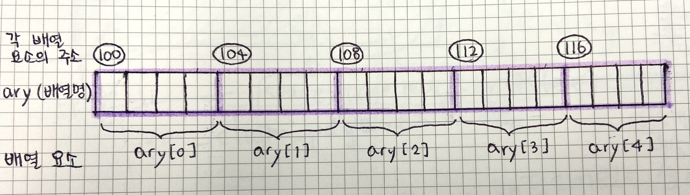

# Chapter10. 배열과 포인터

## 배열과 포인터의 관계

배열은 자료형이 같은 변수를 메모리에 연속으로 할당하므로, 각 배열 요소는 **일정한 간격**으로 주소를 갖게 된다.

```c
int ary[5];
```



즉, 첫 번째 요소의 주소를 알면 나머지 요소의 주소도 쉽게 알 수 있다. 컴파일러는 컴파일 과정에서 배열명(`ary`)을 첫 번째 배열 요소의 주소(`100`)로 변경한다. 결국 **배열명은 첫 번째 배열 요소를 가리키게** 된다.

### 배열명으로 배열 요소 사용하기

- 주소에 대한 정수 덧셈은 다음과 같이 수행된다.

  ```c
  주소 + 정수 👉 주소 + (정수 * 주소를 구한 변수의 크기)
  ```

  <details>
  <summary>예) int형 변수 `a`의 주소 100번지에 1을 더하면?</summary>
  <div markdown="1">

  `&a` + (1 * `sizeof(int)`) = 100 + 4 = **104**

  </div>
  </details>

- 이러한 연산 규칙은 배열을 사용할 때 유용하다. 앞서 살펴봤듯이 배열명도 결국 주소이므로, 배열명에 정수를 차례로 더하면 연속된 배열 요소의 주소를 구할 수 있다. (그리고 이렇게 구한 각 배열 요소의 주소를 간접 참조(역참조)하면 각 배열 요소도 사용할 수 있게 된다.)

  |배열명에 덧셈 연산|각 배열 요소의 주소|각 배열 요소|
  |------|---|---|
  |`*(ary + 0)`|`*(100)`|`ary[0]`|
  |`*(ary + 1)`|`*(104)`|`ary[1]`|
  |`*(ary + 2)`|`*(108)`|`ary[2]`|

### 배열명 역할을 하는 포인터

- 배열명도 결국 주소이므로 포인터에 저장할 수 있다. 이렇게 배열명을 저장한 포인터는 배열처럼 사용할 수 있다.

  ```c
  #include <stdio.h>

  int main(void) {
      int ary[3];
      int *pa = ary; // 포인터에 배열명 저장

      *pa = 1; // ary의 첫 번째 요소에 1 대입
      *(pa + 1) = 2; // ary의 두 번째 요소에 2 대입
      pa[2] = pa[0] + pa[1]; // 포인터에 대괄호를 써서 배열명처럼 사용

      int cnt = sizeof(ary) / sizeof(ary[0]); // 반복 횟수
      int i; // 반복 제어 변수
      for (i = 0; i < cnt; i++) {
          // 포인터로 모든 배열 요소 출력
          printf("%-5d", pa[i]);
      }
      // 1    2    3
      printf("\n");

      return 0;
  }
  ```

  - 참고로 여기서 변환 문자 `%d` 앞에 숫자는 숫자 자리수를 의미한다. 이렇게 지정한 자리수보다 적은 숫자가 오면, 그 빈 자리만큼 공백이 생긴다. 음수를 지정하면 숫자가 왼쪽 정렬(오른쪽에 공백 추가)되고, 양수를 지정하면 숫자가 오른쪽 정렬(왼쪽에 공백 추가)된다. 출력 값을 살펴보면,

    `1    2    3    `

    일단 음수니까 숫자가 왼쪽 정렬되었다. 그리고 5자리라고 지정했는데, 숫자가 각각 한자리씩 밖에 안되기 때문에 나머지 4자리에는 공백이 추가되었다.

### 배열명과 포인터의 차이

- 이와 같이 포인터가 배열명처럼 사용될 수는 있지만 몇 가지 차이점이 있어서, 사용할 때 주의해야 한다.

  - 차이점1: `sizeof` 연산의 결과가 다르다.

    - `sizeof` 연산자를 배열명에 사용하면 **배열 전체의 크기**를 구하는 반면, 포인터에 사용하면 **포인터 하나의 크기**만을 구한다.

      ```c
      int ary[3];
      int *pa = ary;

      sizeof(ary); // 4 * 3 = 12
      sizeof(pa); // 8
      ```

    - 즉, 배열명으로 사용하는 포인터에 `sizeof` 연산을 해서 해당 배열의 전체 크기를 구하는 것은 불가능하다.

  - 차이점2: 변수/상수 차이

    - 포인터는 앞서 9장에서 살펴보았듯이 변수다. (주소 값을 저장하는 용도로 쓰이는 변수) 반면 배열명은 상수이므로, 값을 변경할 수 없다.

      ```c
      pa += 1; (O)
      pa++; (O)

      ary += 1; (X)
      ary++; (X)
      ```

### 포인터의 뺄셈과 관계 연산

- 어떤 두 포인터가 **가리키는 자료형이 동일**하다면, 포인터 간 뺄셈도 가능하다.

  ```c
  포인터 - 포인터 👉 주소 값의 차 / 가리키는 자료형의 크기
  ```

  예) `pi`가 int형 요소를 담는 배열을 가리킬 때,

    ```c
    int diff = (pa + 1) - pa;
    printf("diff: %d\n", diff); // 1
    ```

    만약 `pa`가 100, `pa + 1`이 104라면, 104 - 100 = 4가 된다. 그리고 int형의 크기는 4이므로 4/4 = 1이 된다.

- 관계 연산자로 포인터 간의 대소관계도 확인할 수 있다.

  ```c
  if (pa < pb) {
    ...
  }
  ```

  - 배열은 배열 요소가 메모리에 순서대로 할당되므로, 앞의 배열 요소의 주소 값이 뒤의 배열 요소의 주소 값보다 작다.

## 배열을 처리하는 함수

### 배열의 값을 출력하는 함수

- 

### 배열 요소의 개수가 다른 배열도 출력하는 함수

- 

### 배열에 값을 입력하는 함수

- 
